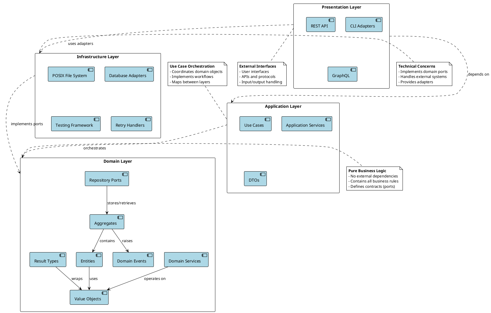
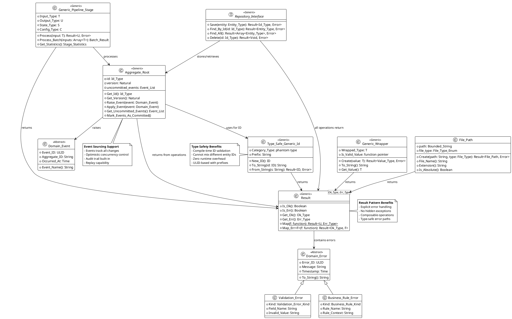
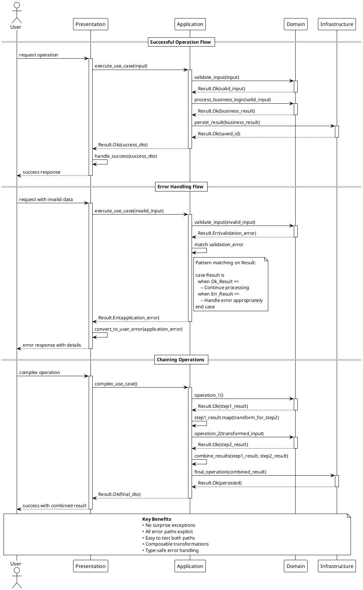
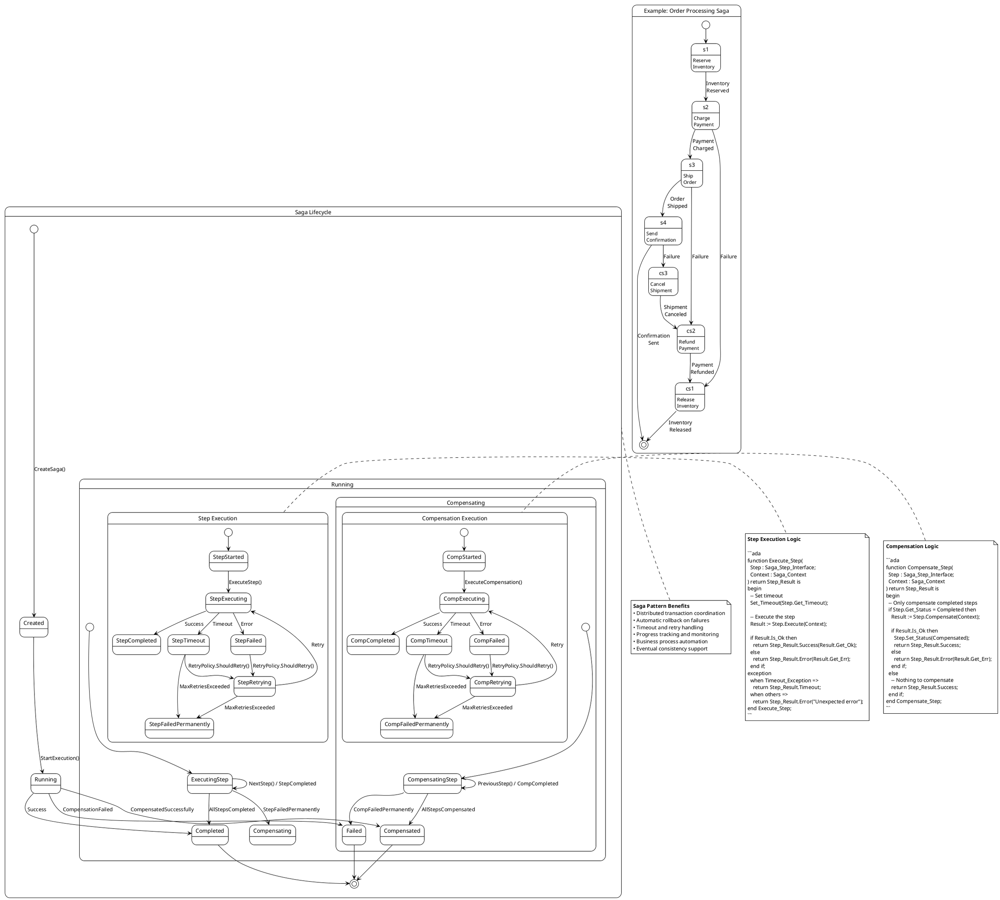

# UML Architecture Diagrams

This document contains comprehensive UML diagrams for the Abohlib Ada 2022 library, specifically designed to help developers understand the hybrid architecture combining Domain-Driven Design, Clean Architecture, and Hexagonal Architecture principles.

## Diagram Files

The source PlantUML files and rendered SVGs are located in the [`../diagrams/`](../diagrams/) directory:
- PlantUML source files: `*.puml`
- Rendered diagrams: `*.svg`

## Table of Contents

1. [Architecture Overview](#1-architecture-overview)
2. [Domain Model](#2-domain-model)
3. [Result Pattern Flow](#3-result-pattern-flow)
4. [Pipeline Processing](#4-pipeline-processing)
5. [Repository Pattern](#5-repository-pattern)
6. [Event Sourcing](#6-event-sourcing)
7. [Saga Pattern](#7-saga-pattern)
8. [How to Use These Diagrams](#how-to-use-these-diagrams)

---

## 1. Architecture Overview

📊 **[View SVG Diagram](../diagrams/architecture_overview.svg)** | **[View PlantUML Source](../diagrams/architecture_overview.puml)**

### Purpose
This diagram shows the overall layered architecture and how dependencies flow between layers according to the Dependency Inversion Principle.

### Key Learning Points
- **Dependency Direction**: All dependencies point inward toward the domain
- **Layer Responsibilities**: Each layer has distinct responsibilities
- **Ports vs Adapters**: Domain defines interfaces (ports), infrastructure provides implementations (adapters)



**Focus Areas for Implementation:**
- Ensure dependencies only point inward
- Keep domain layer free of external dependencies
- Use generic parameters for dependency injection
- Define clear contracts between layers

---

## 2. Domain Model

📊 **[View SVG Diagram](../diagrams/domain_model.svg)** | **[View PlantUML Source](../diagrams/domain_model.puml)**

### Purpose
This diagram shows the core domain objects and their relationships, emphasizing the Result pattern and type safety features.

### Key Learning Points
- **Type-Safe IDs**: Phantom types prevent mixing different entity IDs
- **Result Pattern**: All operations that can fail return Result types
- **Generic Programming**: Extensive use of Ada generics for flexibility
- **Value Objects**: Immutable objects with validation



**Focus Areas for Implementation:**
- Use Result types for all fallible operations
- Create type-safe IDs for all entities
- Implement validation in value object constructors
- Design aggregates with clear consistency boundaries

---

## 3. Result Pattern Flow

📊 **[View SVG Diagram](../diagrams/result_pattern_sequence.svg)** | **[View PlantUML Source](../diagrams/result_pattern_sequence.puml)**

### Purpose
This sequence diagram shows how the Result pattern handles both successful operations and errors without using exceptions.

### Key Learning Points
- **No Exceptions**: All errors are returned as values, not thrown
- **Explicit Handling**: Every error case must be explicitly handled
- **Composability**: Results can be chained and transformed
- **Layer Boundaries**: Results cross architectural boundaries safely



**Focus Areas for Implementation:**
- Never let exceptions cross layer boundaries
- Always handle both Ok and Err cases explicitly
- Use Result.Map for transformations
- Convert errors appropriately at layer boundaries

---

## 4. Pipeline Processing

📊 **[View SVG Diagram](../diagrams/pipeline_processing_activity.svg)** | **[View PlantUML Source](../diagrams/pipeline_processing_activity.puml)**

### Purpose
This activity diagram shows the flow of the Generic_Pipeline_Stage processing system, including batch and parallel processing capabilities.

### Key Learning Points
- **Type Safety**: All inputs and outputs are type-checked at compile time
- **Error Isolation**: Individual item failures don't stop batch processing
- **Parallel Processing**: Ada 2022 parallel features for independent operations
- **Statistics**: Built-in performance monitoring and reporting

```plantuml
@startuml Pipeline_Processing_Activity
!theme plain
start

:Initialize Pipeline Stage\nwith Config and State;

if (Single Item or Batch?) then (Single)
  :Receive Single Input;
  :Validate Input Type;
  if (Input Valid?) then (Yes)
    :Call Process_Element\n(State, Config, Input);
    if (Processing Successful?) then (Yes)
      :Update Statistics\n(Success Count, Time);
      :Return Result.Ok(Output);
    else (No)
      :Update Statistics\n(Error Count);
      :Return Result.Err(Error);
    endif
  else (No)
    :Return Result.Err\n(Validation_Error);
  endif
else (Batch)
  :Receive Input Array;
  :Initialize Output Arrays\n(Results, Success_Flags, Errors);

  if (Parallel Processing Enabled?) then (Yes)
    fork
      :Process Item 1\nin Parallel Block;
    fork again
      :Process Item 2\nin Parallel Block;
    fork again
      :Process Item N\nin Parallel Block;
    end fork

    note right
      Ada 2022 Parallel Processing:

      for I in Input_Array'Range loop
        parallel
          declare
            Result : Output_Type;
          begin
            Result := Process_Element(
              State, Config, Input_Array(I));
            -- Store result safely
          end;
        end parallel;
      end loop;
    end note

  else (No)
    :Process Items Sequentially;

    repeat
      :Get Next Item;
      :Process Item;
      :Store Result in Arrays;
      :Update Individual Statistics;
    repeat while (More Items?)

  endif

  :Combine All Results;
  :Update Batch Statistics;
  :Return Batch Results\n(Outputs, Success_Flags, Errors);
endif

:Log Final Statistics;
:Clean Up Resources;

stop

note top
  **Generic_Pipeline_Stage Benefits**
  • Type-safe at compile time
  • Individual error isolation
  • Built-in performance monitoring
  • Parallel processing support
  • Configurable behavior
  • State management across items
end note

partition "Error Handling" {
  note right
    Error handling strategies:

    1. **Fail Fast**: Stop on first error
    2. **Continue**: Process remaining items
    3. **Retry**: Attempt failed items again
    4. **Circuit Breaker**: Stop after error threshold

    All configurable through Config_Type
  end note
}

partition "Statistics Collection" {
  note left
    Automatic statistics:

    • Items processed count
    • Success/failure rates
    • Processing times (min/max/avg)
    • Memory usage patterns
    • Throughput measurements
    • Error categorization
  end note
}

@enduml
```

**Focus Areas for Implementation:**
- Design processing functions to be pure and stateless when possible
- Use appropriate parallel processing for independent operations
- Implement proper error isolation for batch operations
- Configure statistics collection based on performance requirements

---

## 5. Repository Pattern

📊 **[View SVG Diagram](../diagrams/repository_pattern_class.svg)** | **[View PlantUML Source](../diagrams/repository_pattern_class.puml)**

### Purpose
This class diagram shows how the Repository pattern implements the port/adapter architecture with type-safe operations.

### Key Learning Points
- **Ports vs Adapters**: Domain defines interfaces, infrastructure implements them
- **Type Safety**: Generic repository prevents mixing entity types
- **Transaction Support**: ACID properties for data consistency
- **Multiple Implementations**: Different storage strategies for different needs

```plantuml
@startuml Repository_Pattern_Class
!theme plain

package "Domain Layer (Ports)" {
  interface "Repository_Interface<Entity_Type, Id_Type>" as repo_port <<Generic>> {
    +Save(entity: Entity_Type): Result<Id_Type, Error>
    +Find_By_Id(id: Id_Type): Result<Entity_Type, Error>
    +Find_All(): Result<Array<Entity_Type>, Error>
    +Find_By_Specification(spec: Specification): Result<Array<Entity_Type>, Error>
    +Delete(id: Id_Type): Result<Void, Error>
    +Count(): Result<Natural, Error>
    +Exists(id: Id_Type): Result<Boolean, Error>
  }

  interface "Unit_Of_Work" as uow {
    +Begin_Transaction(): Result<Transaction_Id, Error>
    +Commit(): Result<Void, Error>
    +Rollback(): Result<Void, Error>
    +Register_New(entity: Entity_Type)
    +Register_Dirty(entity: Entity_Type)
    +Register_Removed(id: Id_Type)
  }

  class "Specification<Entity_Type>" as spec <<Generic>> {
    +Is_Satisfied_By(entity: Entity_Type): Boolean
    +And(other: Specification): Specification
    +Or(other: Specification): Specification
    +Not(): Specification
  }
}

package "Infrastructure Layer (Adapters)" {
  class "Database_Repository<Entity_Type, Id_Type>" as db_repo <<Generic>> {
    -connection: Database_Connection
    -table_name: String
    -entity_mapper: Entity_Mapper
    +Save(entity: Entity_Type): Result<Id_Type, Error>
    +Find_By_Id(id: Id_Type): Result<Entity_Type, Error>
    +Execute_Query(sql: String): Result<Result_Set, Error>
    -Map_To_Entity(row: Database_Row): Entity_Type
    -Map_To_Row(entity: Entity_Type): Database_Row
  }

  class "File_Repository<Entity_Type, Id_Type>" as file_repo <<Generic>> {
    -base_directory: File_Path
    -serializer: Entity_Serializer
    +Save(entity: Entity_Type): Result<Id_Type, Error>
    +Find_By_Id(id: Id_Type): Result<Entity_Type, Error>
    -Serialize_Entity(entity: Entity_Type): Result<String, Error>
    -Deserialize_Entity(data: String): Result<Entity_Type, Error>
  }

  class "In_Memory_Repository<Entity_Type, Id_Type>" as mem_repo <<Generic>> {
    -entities: Map<Id_Type, Entity_Type>
    -next_id: Id_Type
    +Save(entity: Entity_Type): Result<Id_Type, Error>
    +Find_By_Id(id: Id_Type): Result<Entity_Type, Error>
    +Clear(): Result<Void, Error>
  }

  class "Caching_Repository<Entity_Type, Id_Type>" as cache_repo <<Generic>> {
    -underlying: Repository_Interface
    -cache: LRU_Cache<Id_Type, Entity_Type>
    -cache_policy: Cache_Policy
    +Save(entity: Entity_Type): Result<Id_Type, Error>
    +Find_By_Id(id: Id_Type): Result<Entity_Type, Error>
    -Cache_Entity(id: Id_Type, entity: Entity_Type)
    -Evict_From_Cache(id: Id_Type)
  }

  class "Transaction_Repository<Entity_Type, Id_Type>" as tx_repo <<Generic>> {
    -underlying: Repository_Interface
    -unit_of_work: Unit_Of_Work
    -transaction_isolation: Isolation_Level
    +Save(entity: Entity_Type): Result<Id_Type, Error>
    +Find_By_Id(id: Id_Type): Result<Entity_Type, Error>
    +Begin_Transaction(): Result<Void, Error>
    +Commit_Transaction(): Result<Void, Error>
    +Rollback_Transaction(): Result<Void, Error>
  }
}

' Relationships
repo_port <|.. db_repo : implements
repo_port <|.. file_repo : implements
repo_port <|.. mem_repo : implements
repo_port <|.. cache_repo : implements
repo_port <|.. tx_repo : implements

cache_repo --> repo_port : delegates to
tx_repo --> repo_port : delegates to
tx_repo --> uow : uses

repo_port --> spec : uses for queries

note right of repo_port
  **Port Definition**
  - Defines contract
  - Domain-centric interface
  - Result-based operations
  - Generic for type safety
end note

note left of db_repo
  **Database Adapter**
  - SQL generation
  - Connection management
  - Transaction support
  - Entity mapping
end note

note bottom of cache_repo
  **Decorator Pattern**
  - Wraps another repository
  - Adds caching capability
  - Configurable cache policies
  - Transparent to clients
end note

note top of tx_repo
  **Transaction Support**
  - ACID properties
  - Isolation levels
  - Unit of Work pattern
  - Rollback capabilities
end note

@enduml
```



**Focus Areas for Implementation:**
- Define repository interfaces in the domain layer
- Implement adapters in infrastructure layer
- Use generic programming for type safety
- Support transactions for data consistency
- Consider caching and performance optimizations

---

## 6. Event Sourcing

📊 **[View SVG Diagram](../diagrams/event_sourcing_sequence.svg)** | **[View PlantUML Source](../diagrams/event_sourcing_sequence.puml)**

### Purpose
This sequence diagram shows how domain events are created, stored, and used to reconstruct aggregate state.

### Key Learning Points
- **Event Store**: All changes are stored as immutable events
- **Aggregate Reconstruction**: State is rebuilt by replaying events
- **Event Handlers**: Multiple subscribers can react to domain events
- **Optimistic Concurrency**: Version numbers prevent conflicting updates

```plantuml
@startuml Event_Sourcing_Sequence
!theme plain
actor "Client" as client
participant "Application\nService" as app
participant "Aggregate\nRoot" as aggregate
participant "Event\nStore" as eventstore
participant "Event\nDispatcher" as dispatcher
participant "Event\nHandler 1" as handler1
participant "Event\nHandler 2" as handler2

== Command Processing ==

client -> app: ExecuteCommand(command)
activate app

app -> eventstore: LoadAggregate(aggregate_id)
activate eventstore

eventstore -> eventstore: RetrieveEvents(aggregate_id)
eventstore --> app: EventStream(events, version)
deactivate eventstore

app -> aggregate: ReconstructFromEvents(events)
activate aggregate

loop for each event in stream
  aggregate -> aggregate: ApplyEvent(event)
  note right of aggregate
    Aggregate state is rebuilt
    by applying each historical
    event in chronological order
  end note
end

aggregate --> app: ReconstructedAggregate(version)
deactivate aggregate

app -> aggregate: ExecuteCommand(command)
activate aggregate

aggregate -> aggregate: ValidateBusinessRules()
alt Business rules satisfied
  aggregate -> aggregate: CreateDomainEvent()
  aggregate -> aggregate: ApplyEvent(new_event)
  aggregate -> aggregate: AddToUncommittedEvents(new_event)
  aggregate --> app: CommandResult.Success()
else Business rules violated
  aggregate --> app: CommandResult.Error(business_rule_error)
end
deactivate aggregate

alt Command succeeded
  app -> eventstore: SaveEvents(aggregate_id, uncommitted_events, expected_version)
  activate eventstore

  eventstore -> eventstore: CheckOptimisticConcurrency(expected_version)
  alt No conflicts
    eventstore -> eventstore: PersistEvents(events)
    eventstore --> app: SaveResult.Success(new_version)

    app -> dispatcher: DispatchEvents(committed_events)
    activate dispatcher

    par Event Handler 1
      dispatcher -> handler1: HandleEvent(domain_event)
      activate handler1
      handler1 -> handler1: ProcessEvent()
      handler1 --> dispatcher: HandlingResult.Success()
      deactivate handler1
    and Event Handler 2
      dispatcher -> handler2: HandleEvent(domain_event)
      activate handler2
      handler2 -> handler2: ProcessEvent()
      handler2 --> dispatcher: HandlingResult.Success()
      deactivate handler2
    end

    dispatcher --> app: DispatchResult.Success()
    deactivate dispatcher

  else Version conflict
    eventstore --> app: SaveResult.Error(concurrency_conflict)
    note left of app
      Optimistic concurrency control:
      If expected version doesn't match
      current version, another process
      has modified the aggregate
    end note
  end
  deactivate eventstore
end

app --> client: CommandResult
deactivate app

== Query Processing (Event Replay) ==

client -> app: GetAggregateState(aggregate_id)
activate app

app -> eventstore: LoadAggregate(aggregate_id)
activate eventstore

eventstore -> eventstore: RetrieveAllEvents(aggregate_id)
eventstore --> app: EventStream(all_events, current_version)
deactivate eventstore

app -> aggregate: ReconstructFromEvents(all_events)
activate aggregate

loop for each historical event
  aggregate -> aggregate: ApplyEvent(event)
  note right of aggregate
    State is always derived from
    the complete event history.
    No separate state storage needed.
  end note
end

aggregate --> app: CurrentState(version)
deactivate aggregate

app --> client: AggregateState
deactivate app

note over client, handler2
  **Event Sourcing Benefits**
  • Complete audit trail
  • Temporal queries (state at any point in time)
  • Event replay for debugging
  • Multiple read models from same events
  • Natural business event capture
end note

@enduml
```

**Focus Areas for Implementation:**
- Design events as immutable facts about what happened
- Implement event store with append-only semantics
- Use optimistic concurrency control with version numbers
- Create meaningful event names that reflect business language
- Handle event versioning for schema evolution

---

## 7. Saga Pattern

📊 **[View SVG Diagram](../diagrams/saga_pattern_state.svg)** | **[View PlantUML Source](../diagrams/saga_pattern_state.puml)**

### Purpose
This state diagram shows how the Saga pattern manages distributed transactions with compensation logic.

### Key Learning Points
- **Distributed Transactions**: Coordinate across multiple services/aggregates
- **Compensation**: Undo completed steps when later steps fail
- **State Management**: Track saga and individual step states
- **Timeout Handling**: Prevent infinite waiting for responses



**Focus Areas for Implementation:**
- Design each step to be idempotent (safe to retry)
- Implement proper compensation logic for each step
- Use timeouts to prevent hanging operations
- Store saga state persistently for recovery
- Monitor saga progress and handle failures appropriately

---

## How to Use These Diagrams

### For Learning
1. **Start with Architecture Overview** to understand the big picture
2. **Study Domain Model** to see how components relate
3. **Follow Result Pattern** to understand error handling philosophy
4. **Explore specific patterns** (Pipeline, Repository, Events, Saga) as needed

### For Implementation
1. **Reference diagrams during design** to ensure architectural compliance
2. **Use as templates** for creating similar components
3. **Review during code reviews** to check adherence to patterns
4. **Update diagrams** when making architectural changes

### For Code Reviews
Check that implementations follow these patterns:
- [ ] Dependencies point inward (Architecture Overview)
- [ ] All fallible operations return Results (Result Pattern)
- [ ] Type-safe IDs used consistently (Domain Model)
- [ ] Repository interfaces defined in domain (Repository Pattern)
- [ ] Events are immutable and meaningful (Event Sourcing)
- [ ] Saga steps are idempotent with compensation (Saga Pattern)

### Rendering Diagrams
To render these PlantUML diagrams:

```bash
# Install PlantUML
sudo apt-get install plantuml  # Ubuntu/Debian
brew install plantuml          # macOS

# Render all diagrams
find docs -name "*.puml" -exec plantuml {} \;

# Or use online renderer
# Copy diagram code to: http://www.plantuml.com/plantuml/uml/
```

### Further Reading
- **Domain-Driven Design** by Eric Evans
- **Clean Architecture** by Robert C. Martin
- **Implementing Domain-Driven Design** by Vaughn Vernon
- **Ada 2022 Reference Manual** for language features
- **Building Event-Driven Microservices** by Adam Bellemare
